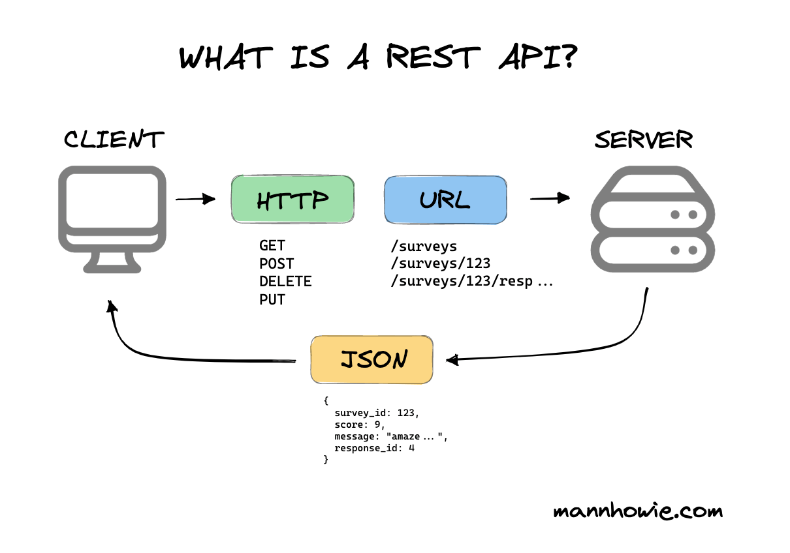
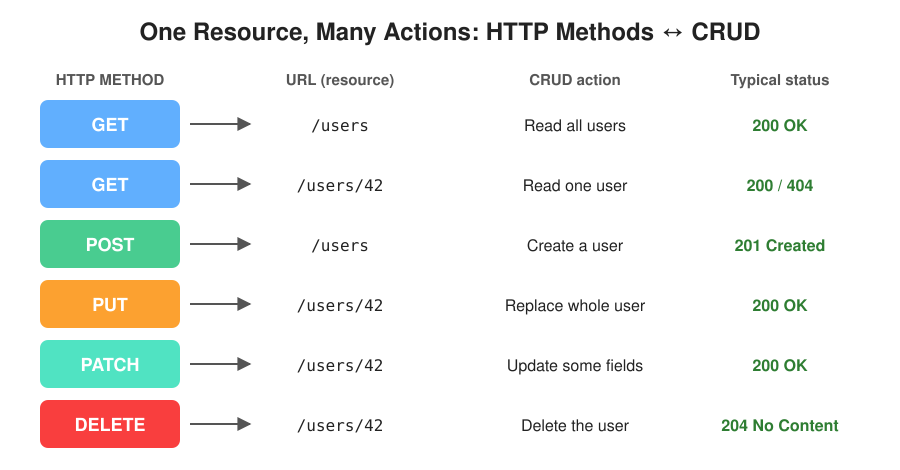
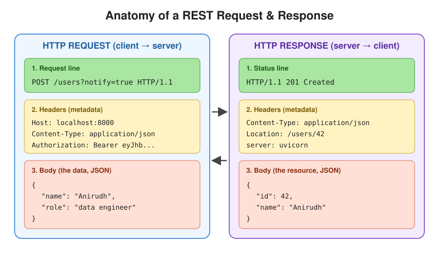

# REST API



## 1. What is an API?

An **API (Application Programming Interface) is a contract that lets one program ask another program to do something or give it some data.**

You already use APIs all the time:

- A weather app asks a weather server for today's forecast
- A frontend asks a backend for a list of users
- An ETL script asks a source system for yesterday's sales
- Python `requests` calls a FastAPI endpoint

Think of a restaurant:

```text
You (client)  →  Waiter (API)  →  Kitchen (server / database)
                     ↓
You  ←  Waiter brings food (response)
```

You don't walk into the kitchen. You use the menu (the contract) and the waiter (the API).

---

# 2. What is REST?

REST stands for:

**RE**presentational **S**tate **T**ransfer

It is **not** a library, a language, or a protocol.

> **REST is an architectural style: a set of rules for designing APIs on top of HTTP.**

An API that follows these rules is called a **REST API** (or **RESTful API**).

Breaking the name down:

```text
Representational → the server sends a REPRESENTATION of the data (usually JSON)
State            → the current data/state of a resource (e.g. user 42's details)
Transfer         → that representation is transferred over HTTP
```

---

# 3. The Big Picture

Every REST interaction has the same shape:

```text
┌──────────────┐                                   ┌──────────────┐
│              │   HTTP METHOD  +  URL  (+ body)   │              │
│    CLIENT    │ ────────────────────────────────▶ │    SERVER    │
│              │   GET /users/42                   │   (FastAPI)  │
│  Browser     │                                   │              │
│  Postman     │   STATUS CODE  +  JSON            │   Database   │
│  Frontend    │ ◀──────────────────────────────── │              │
│  ETL script  │   200 OK  {"id": 42, ...}         │              │
└──────────────┘                                   └──────────────┘
```

In one line:

> **The client says WHAT it wants to do (HTTP method) to WHICH thing (URL), and the server replies with a status code and the data (JSON).**

---

# 4. Resources: The Heart of REST

In REST, everything is a **resource**: a "thing" your API exposes.

Examples:

```text
users
products
orders
surveys
etl_jobs
```

Every resource is identified by a **URL**.

```text
/users              → the collection of all users
/users/42           → one specific user (id = 42)
/users/42/orders    → all orders belonging to user 42
/users/42/orders/7  → order 7 of user 42
```

### Anatomy of a URL

```text
   http://localhost:8000/users/42/orders?status=paid&limit=10
   └─┬─┘  └──────┬─────┘└──────┬───────┘└─────────┬─────────┘
  scheme       host       path             query parameters
                        (the resource)    (filter / sort / paginate)
```

### Golden rule: URLs are **nouns**, methods are **verbs**

```text
BAD (verbs in URL)               GOOD (noun URL + HTTP verb)

GET  /getUsers                   GET    /users
POST /createUser                 POST   /users
POST /deleteUser?id=42           DELETE /users/42
GET  /updateUserName/42          PATCH  /users/42
```

Other naming conventions:

- Use **plural** nouns: `/users`, not `/user`
- Use **lowercase** and **hyphens**: `/sales-reports`, not `/SalesReports`
- Nest only when there is a real relationship: `/users/42/orders`

---

# 5. HTTP Methods: The Verbs

The HTTP method tells the server **what action** to perform on the resource.



| Method | CRUD | Meaning | Has body? |
|---|---|---|---|
| **GET** | Read | Fetch a resource | No |
| **POST** | Create | Create a new resource | Yes |
| **PUT** | Update (replace) | Replace the entire resource | Yes |
| **PATCH** | Update (partial) | Change only some fields | Yes |
| **DELETE** | Delete | Remove the resource | Usually no |

### PUT vs PATCH

Suppose user 42 currently is:

```json
{ "id": 42, "name": "Anirudh", "city": "Kochi", "role": "intern" }
```

```text
PATCH /users/42   body: {"role": "data engineer"}

  → only "role" changes
  → { "id": 42, "name": "Anirudh", "city": "Kochi", "role": "data engineer" }


PUT /users/42     body: {"name": "Anirudh", "role": "data engineer"}

  → the WHOLE resource is replaced
  → { "id": 42, "name": "Anirudh", "role": "data engineer" }   ← "city" is gone!
```

---

# 6. Safe and Idempotent Methods

Two important properties:

- **Safe** → does not change anything on the server (read-only)
- **Idempotent** → calling it **once or 10 times** leaves the server in the **same state**

| Method | Safe? | Idempotent? | Why |
|---|---|---|---|
| GET | Yes | Yes | Only reads |
| PUT | No | Yes | Replacing with the same data 10 times → same result |
| DELETE | No | Yes | Deleted once or 10 times → it's gone |
| PATCH | No | Not guaranteed | e.g. `{"balance": "+100"}` adds money each time |
| POST | No | No | Calling 10 times → 10 new users created |

```text
POST /users  ×3                    PUT /users/42  ×3
     ↓                                  ↓
 user 43 created                   user 42 = {...}
 user 44 created                   user 42 = {...}   (same)
 user 45 created                   user 42 = {...}   (same)
 → 3 new rows!                     → still 1 row
```

**Why care?** Networks fail. If a request times out, a client can safely **retry** an idempotent request. Retrying a POST might create duplicates, which matters a lot in data pipelines.

---

# 7. Request and Response



### A request has

```text
1. Method + URL      →  POST /users
2. Headers           →  metadata (Content-Type, Authorization, ...)
3. Body (optional)   →  the data you are sending, usually JSON
```

### A response has

```text
1. Status code       →  201 Created
2. Headers           →  metadata (Content-Type, Location, ...)
3. Body (optional)   →  the resource representation, usually JSON
```

### Why JSON?

JSON is the most common representation because it is:

- human readable
- language independent (Python, JavaScript, Java can all read it)
- maps naturally to Python `dict` / `list`

```text
Python dict  ──(FastAPI)──▶  JSON text  ──(HTTP)──▶  Client
{"id": 42}                   '{"id": 42}'
```

---

# 8. HTTP Status Codes

The status code tells the client **what happened**, without reading the body.

```text
        ┌───────────────────────────────────────────────────┐
  1xx   │ Informational   "hold on..."              (rare)  │
        ├───────────────────────────────────────────────────┤
  2xx   │ Success         "here you go"                     │
        ├───────────────────────────────────────────────────┤
  3xx   │ Redirection     "look over there"                 │
        ├───────────────────────────────────────────────────┤
  4xx   │ Client error    "YOU did something wrong"         │
        ├───────────────────────────────────────────────────┤
  5xx   │ Server error    "WE did something wrong"          │
        └───────────────────────────────────────────────────┘
```

The ones you will use most:

| Code | Name | When |
|---|---|---|
| **200** | OK | Successful GET / PUT / PATCH |
| **201** | Created | Successful POST that created something |
| **204** | No Content | Successful DELETE, nothing to return |
| **400** | Bad Request | Malformed request |
| **401** | Unauthorized | Not logged in / missing or bad token |
| **403** | Forbidden | Logged in, but not allowed |
| **404** | Not Found | Resource doesn't exist (`/users/9999`) |
| **409** | Conflict | e.g. email already exists |
| **422** | Unprocessable Entity | Validation failed (**FastAPI uses this a lot**) |
| **500** | Internal Server Error | Bug / unhandled exception in your code |

---

# 9. The 6 REST Constraints

These are the rules that make an API "RESTful".

### 1. Client–Server

The client (UI) and server (data + logic) are **separate** and evolve independently.

```text
┌────────────┐            ┌────────────┐
│  React UI  │ ◀──HTTP──▶ │  FastAPI   │
│  Mobile    │            │  Database  │
└────────────┘            └────────────┘
  can change                can change
  freely                    freely
```

### 2. Stateless (most important)

**Every request must contain everything the server needs to understand it.**
The server does **not** remember previous requests.

```text
STATEFUL                             STATELESS

Req 1: "I am Anirudh"                Req 1: GET /orders
Req 2: "Show my orders"                     Authorization: Bearer <token>
        ↑                            Req 2: GET /orders/7
        server must remember                Authorization: Bearer <token>
        who you are                          ↑
                                             each request carries its own identity
```

Why it matters: any server can handle any request, so you can easily run many copies behind a load balancer.

```text
                  ┌──▶ FastAPI instance 1
Client ──▶ Load ──┼──▶ FastAPI instance 2     any instance can answer
         Balancer └──▶ FastAPI instance 3     because no memory is needed
```

### 3. Cacheable

Responses should say whether they can be cached (e.g. `Cache-Control` header), so repeated GETs don't always hit the server.

### 4. Uniform Interface

Every resource is handled the **same way**: URLs identify resources, HTTP methods act on them, and responses use standard representations (JSON) and status codes. Learn one REST API, and you roughly know how to use them all.

### 5. Layered System

The client doesn't know (or care) how many layers sit in between.

```text
Client → CDN → Nginx → Uvicorn → FastAPI → Database
          ↑ the client only ever talks to "the API"
```

### 6. Code on Demand (optional)

The server *may* send executable code (e.g. JavaScript) to the client. Rarely relevant for APIs.

---

# 10. A Complete Example in FastAPI

```python
from fastapi import FastAPI, HTTPException, status
from pydantic import BaseModel

app = FastAPI()

class User(BaseModel):
    name: str
    role: str

users: dict[int, User] = {}
next_id = 1


@app.get("/users")                                  # Read all
def list_users():
    return users


@app.get("/users/{user_id}")                        # Read one
def get_user(user_id: int):
    if user_id not in users:
        raise HTTPException(status_code=404, detail="User not found")
    return users[user_id]


@app.post("/users", status_code=status.HTTP_201_CREATED)   # Create
def create_user(user: User):
    global next_id
    users[next_id] = user
    next_id += 1
    return {"id": next_id - 1, **user.model_dump()}


@app.put("/users/{user_id}")                        # Replace
def replace_user(user_id: int, user: User):
    if user_id not in users:
        raise HTTPException(status_code=404, detail="User not found")
    users[user_id] = user
    return user


@app.delete("/users/{user_id}", status_code=status.HTTP_204_NO_CONTENT)  # Delete
def delete_user(user_id: int):
    if user_id not in users:
        raise HTTPException(status_code=404, detail="User not found")
    del users[user_id]
```

Notice how the code mirrors REST directly:

```text
@app.get    ("/users")            → GET    /users
@app.get    ("/users/{user_id}")  → GET    /users/42
@app.post   ("/users")            → POST   /users
@app.put    ("/users/{user_id}")  → PUT    /users/42
@app.delete ("/users/{user_id}")  → DELETE /users/42
```

Run it with `uvicorn main:app --reload` and try it at `http://localhost:8000/docs`.

---

# 11. Walking Through One Request

What happens when a client creates a user:

```text
 CLIENT                     UVICORN              FASTAPI                    YOUR CODE
   │                           │                    │                           │
   │ POST /users               │                    │                           │
   │ {"name":"Anirudh",        │                    │                           │
   │  "role":"data engineer"}  │                    │                           │
   │──────────────────────────▶│                    │                           │
   │                           │──── ASGI ─────────▶│                           │
   │                           │                    │ 1. match route            │
   │                           │                    │    POST /users            │
   │                           │                    │ 2. parse JSON body        │
   │                           │                    │ 3. validate with          │
   │                           │                    │    Pydantic (User)        │
   │                           │                    │   (fails → 422)           │
   │                           │                    │──────────────────────────▶│
   │                           │                    │                           │ create_user()
   │                           │                    │◀──────────────────────────│ returns dict
   │                           │                    │ 4. dict → JSON            │
   │                           │◀─── ASGI ──────────│                           │
   │ 201 Created               │                    │                           │
   │ {"id":1,"name":"Anirudh", │                    │                           │
   │  "role":"data engineer"}  │                    │                           │
   │◀──────────────────────────│                    │                           │
```

---

# 12. Calling a REST API from Python

The **client** side, e.g. from an ETL script:

```python
import requests

BASE = "http://localhost:8000"

# Create
r = requests.post(f"{BASE}/users", json={"name": "Anirudh", "role": "data engineer"})
print(r.status_code)   # 201
print(r.json())        # {'id': 1, 'name': 'Anirudh', 'role': 'data engineer'}

# Read
r = requests.get(f"{BASE}/users/1")
print(r.json())

# Not found
r = requests.get(f"{BASE}/users/999")
print(r.status_code)   # 404

# Delete
r = requests.delete(f"{BASE}/users/1")
print(r.status_code)   # 204
```

---

# 13. REST in Data Engineering

REST APIs show up everywhere in data work:

```text
                         ┌───────────────────┐
  Source REST APIs ─────▶│                   │
  (Salesforce, Stripe,   │   EXTRACT         │
   GitHub, weather...)   │   requests.get()  │
                         └─────────┬─────────┘
                                   ↓
                         ┌───────────────────┐
                         │   TRANSFORM       │
                         │   pandas / spark  │
                         └─────────┬─────────┘
                                   ↓
                         ┌───────────────────┐
                         │   LOAD            │──▶ Warehouse
                         └─────────┬─────────┘
                                   ↓
                         ┌───────────────────┐
  Dashboards / apps ◀────│  YOUR FastAPI     │  GET  /sales-reports
                         │  REST API         │  POST /etl-jobs
                         └───────────────────┘  GET  /etl-jobs/17
```

Common patterns:

- **Pagination**: `GET /orders?page=2&limit=100` or `?cursor=abc123` (never return a million rows at once)
- **Filtering**: `GET /orders?status=paid&date_from=2026-01-01`
- **Long jobs**: `POST /etl-jobs` returns `202 Accepted` + a job id, then the client polls `GET /etl-jobs/{id}`
- **Rate limits**: APIs may reply `429 Too Many Requests`; back off and retry
- **Idempotency**: prefer idempotent loads so retries don't create duplicate rows

---

# 14. REST vs Other API Styles (quick look)

| | REST | GraphQL | gRPC | SOAP |
|---|---|---|---|---|
| Format | JSON | JSON | Protobuf (binary) | XML |
| Endpoints | Many (one per resource) | One (`/graphql`) | Methods on a service | One |
| Strength | Simple, universal, cacheable | Client picks exact fields | Very fast, service-to-service | Strict contracts (enterprise/legacy) |
| Used with | FastAPI, Django, Express | Strawberry, Apollo | microservices | banks, old systems |

For learning FastAPI, **REST is what you'll build 95% of the time.**

---

# 15. The Most Important Mental Model

```text
          WHAT to do              WHICH thing             RESULT
        ┌────────────┐          ┌─────────────┐        ┌──────────────┐
        │ HTTP METHOD│    +     │     URL     │   →    │ STATUS CODE  │
        │  (verb)    │          │  (noun)     │        │     +        │
        │            │          │             │        │    JSON      │
        │ GET        │          │ /users      │        │ 200 [...]    │
        │ POST       │          │ /users      │        │ 201 {...}    │
        │ PUT/PATCH  │          │ /users/42   │        │ 200 {...}    │
        │ DELETE     │          │ /users/42   │        │ 204          │
        └────────────┘          └─────────────┘        └──────────────┘
                      every request is STATELESS
```

### In one sentence:

> **A REST API exposes resources at URLs; clients act on them with HTTP methods, and the server responds with a status code and a JSON representation, with every request standing on its own.**

### The 6 terms you should remember

| Term | Meaning |
|---|---|
| **Resource** | A "thing" the API exposes (user, order, job) |
| **Endpoint** | Method + URL combination, e.g. `GET /users/{id}` |
| **HTTP method** | The action: GET, POST, PUT, PATCH, DELETE |
| **Status code** | What happened: 2xx ok, 4xx client error, 5xx server error |
| **JSON** | The usual representation of a resource |
| **Stateless** | Each request carries everything needed; server keeps no session memory |
